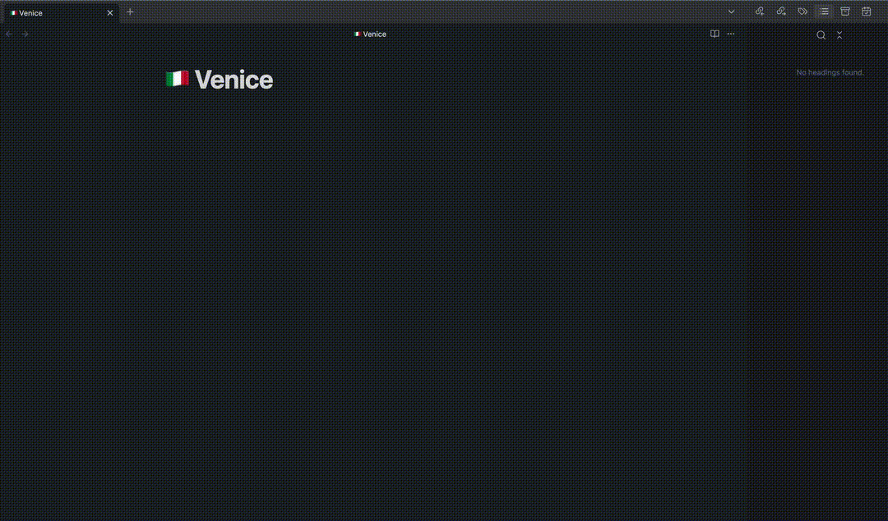

# Obsidian AI Image Rename Plugin

-   By default, Obsidian saves images that you paste into your notes with a generic name like `Pasted Image YYYYDDMM`.
-   This plugin enables auto renaming of image files pasted in obsidian notes using GPT 4o.

## Preview

### Credits

-   Inspired from (https://github.com/reorx/obsidian-paste-image-rename), which shows a modal or generates new name using a image pattern.
